<!-- 英文源文件由 scripts/gen-module-graph.ts 生成；本中文文件是通过双语配对维护的经评审对侧。
     更新时先运行 `pnpm run gen-module-graph` 更新英文，再更新本文件并运行 `pnpm run verify-translation-pairing --write docs/module-graph.md` 重新记录配对。 -->

# 模块依赖关系图

[English](module-graph.md) | 中文

```mermaid
flowchart TD
  subgraph group_util["packages/util"]
    pkg_atomic_write["atomic-write"]
    pkg_brand["brand"]
    pkg_home_paths["home-paths"]
    pkg_launch_environment["launch-environment"]
    pkg_native_command["native-command"]
    pkg_output_retention["output-retention"]
    pkg_timeout["timeout"]
  end
  subgraph group_llm["packages/llm"]
    pkg_llm["llm"]
    pkg_llm_deepseek["llm-deepseek"]
    pkg_llm_pi_ai["llm-pi-ai"]
    pkg_llm_retry["llm-retry"]
    pkg_token_meter["token-meter"]
  end
  subgraph group_core["packages/core"]
    pkg_agent["agent"]
    pkg_agent_default_model["agent-default-model"]
    pkg_agent_loop["agent-loop"]
    pkg_agent_tool_presentation["agent-tool-presentation"]
    pkg_scope["scope"]
    pkg_session["session"]
    pkg_system_prompt["system-prompt"]
    pkg_tools["tools"]
  end
  subgraph group_goal["packages/goal"]
    pkg_command_goal["command-goal"]
    pkg_goal["goal"]
    pkg_goal_round_driver["goal-round-driver"]
    pkg_tool_goal["tool-goal"]
  end
  subgraph group_fs["packages/fs"]
    pkg_fs["fs"]
    pkg_fs_local["fs-local"]
    pkg_fs_observation_policy["fs-observation-policy"]
    pkg_fs_sandbox["fs-sandbox"]
    pkg_tool_fs["tool-fs"]
    pkg_tool_fs_search["tool-fs-search"]
    pkg_tool_str_replace_editor["tool-str-replace-editor"]
  end
  subgraph group_skill["packages/skill"]
    pkg_skill["skill"]
    pkg_skill_badge["skill-badge"]
    pkg_skill_filesystem["skill-filesystem"]
    pkg_tool_skill["tool-skill"]
  end
  subgraph group_subagent["packages/subagent"]
    pkg_subagent["subagent"]
    pkg_subagent_acp["subagent-acp"]
    pkg_subagent_claude_code["subagent-claude-code"]
    pkg_subagent_codex["subagent-codex"]
    pkg_subagent_dsh_sdk["subagent-dsh-sdk"]
    pkg_subagent_fork_in_process["subagent-fork-in-process"]
    pkg_subagent_in_process_driver["subagent-in-process-driver"]
    pkg_subagent_spawn_in_process["subagent-spawn-in-process"]
    pkg_tool_subagent["tool-subagent"]
    pkg_tool_subagent_control["tool-subagent-control"]
    pkg_tool_subagent_report["tool-subagent-report"]
  end
  subgraph group_web["packages/web"]
    pkg_tool_web["tool-web"]
    pkg_web["web"]
    pkg_web_fetch_http["web-fetch-http"]
    pkg_web_search_deepseek["web-search-deepseek"]
    pkg_web_search_exa["web-search-exa"]
    pkg_web_search_perplexity["web-search-perplexity"]
  end
  subgraph group_spill["packages/spill"]
    pkg_spill["spill"]
    pkg_spill_local["spill-local"]
    pkg_spill_policy["spill-policy"]
  end
  subgraph group_todo["packages/todo"]
    pkg_tool_todo["tool-todo"]
  end
  subgraph group_plan["packages/plan"]
    pkg_plan_mode["plan-mode"]
  end
  subgraph group_hooks["packages/hooks"]
    pkg_hook_protocol["hook-protocol"]
    pkg_hooks_claude_code["hooks-claude-code"]
    pkg_hooks_codex["hooks-codex"]
  end
  subgraph group_session_query["packages/session-query"]
    pkg_session_log_export["session-log-export"]
    pkg_session_query["session-query"]
    pkg_session_query_sqlite["session-query-sqlite"]
    pkg_tool_session_query["tool-session-query"]
  end
  subgraph group_acp["packages/acp"]
    pkg_acp["acp"]
  end
  subgraph group_api["packages/api"]
    pkg_api_gateway["api-gateway"]
    pkg_api_remotes["api-remotes"]
  end
  subgraph group_attachment["packages/attachment"]
    pkg_attachment["attachment"]
    pkg_attachment_local["attachment-local"]
  end
  subgraph group_boot["packages/boot"]
    pkg_app_boot["app-boot"]
    pkg_cmdline["cmdline"]
  end
  subgraph group_bundle["packages/bundle"]
    pkg_base["base"]
    pkg_headless["headless"]
    pkg_web_app["web-app"]
  end
  subgraph group_business["packages/business"]
    pkg_business_workflow["business-workflow"]
    pkg_business_workflow_local["business-workflow-local"]
    pkg_tool_business_workflow["tool-business-workflow"]
  end
  subgraph group_client["packages/client"]
    pkg_client_connection["client-connection"]
    pkg_client_hmr["client-hmr"]
    pkg_client_locale["client-locale"]
    pkg_client_modules["client-modules"]
    pkg_client_runtime["client-runtime"]
    pkg_client_ui_agent_preset["client-ui-agent-preset"]
    pkg_client_ui_attachment["client-ui-attachment"]
    pkg_client_ui_brand_official["client-ui-brand-official"]
    pkg_client_ui_commands["client-ui-commands"]
    pkg_client_ui_conversation["client-ui-conversation"]
    pkg_client_ui_deliverables["client-ui-deliverables"]
    pkg_client_ui_directory_picker_browse["client-ui-directory-picker-browse"]
    pkg_client_ui_directory_picker_native["client-ui-directory-picker-native"]
    pkg_client_ui_goal["client-ui-goal"]
    pkg_client_ui_input_trigger["client-ui-input-trigger"]
    pkg_client_ui_jobs["client-ui-jobs"]
    pkg_client_ui_layout["client-ui-layout"]
    pkg_client_ui_message_feedback["client-ui-message-feedback"]
    pkg_client_ui_model_selection["client-ui-model-selection"]
    pkg_client_ui_permission_presets["client-ui-permission-presets"]
    pkg_client_ui_plan["client-ui-plan"]
    pkg_client_ui_primitives["client-ui-primitives"]
    pkg_client_ui_reference["client-ui-reference"]
    pkg_client_ui_renderer["client-ui-renderer"]
    pkg_client_ui_settings["client-ui-settings"]
    pkg_client_ui_settings_general["client-ui-settings-general"]
    pkg_client_ui_settings_models["client-ui-settings-models"]
    pkg_client_ui_settings_plugin_inventory["client-ui-settings-plugin-inventory"]
    pkg_client_ui_settings_plugins["client-ui-settings-plugins"]
    pkg_client_ui_sidebar["client-ui-sidebar"]
    pkg_client_ui_skill["client-ui-skill"]
    pkg_client_ui_slots["client-ui-slots"]
    pkg_client_ui_subagent["client-ui-subagent"]
    pkg_client_ui_theme["client-ui-theme"]
    pkg_client_ui_tool["client-ui-tool"]
    pkg_client_ui_trajectory["client-ui-trajectory"]
    pkg_client_ui_user_questions["client-ui-user-questions"]
    pkg_client_ui_workflow_run["client-ui-workflow-run"]
    pkg_client_ui_workspace["client-ui-workspace"]
    pkg_client_web["client-web"]
  end
  subgraph group_code_runtime["packages/code-runtime"]
    pkg_code_runtime["code-runtime"]
    pkg_code_runtime_python["code-runtime-python"]
    pkg_code_runtime_worker_thread["code-runtime-worker-thread"]
  end
  subgraph group_compaction["packages/compaction"]
    pkg_command_compact["command-compact"]
    pkg_compaction["compaction"]
    pkg_compaction_basic["compaction-basic"]
    pkg_compaction_tool_result_pruner["compaction-tool-result-pruner"]
  end
  subgraph group_context["packages/context"]
    pkg_agent_instructions["agent-instructions"]
    pkg_file_reference["file-reference"]
    pkg_file_reference_local["file-reference-local"]
    pkg_session_reference["session-reference"]
    pkg_time_context["time-context"]
    pkg_tmux_context["tmux-context"]
  end
  subgraph group_credentials["packages/credentials"]
    pkg_authorization["authorization"]
    pkg_credentials["credentials"]
    pkg_credentials_local["credentials-local"]
  end
  subgraph group_e2b["packages/e2b"]
    pkg_e2b["e2b"]
    pkg_fs_e2b["fs-e2b"]
    pkg_subprocess_e2b["subprocess-e2b"]
  end
  subgraph group_examples["packages/examples"]
    pkg_acp_demo["acp-demo"]
    pkg_agent_spine_demo["agent-spine-demo"]
    pkg_sdk_jsonrpc_demo["sdk-jsonrpc-demo"]
  end
  subgraph group_experimental["packages/experimental"]
    pkg_experimental_agent_team["experimental-agent-team"]
    pkg_experimental_tool_agent_team["experimental-tool-agent-team"]
  end
  subgraph group_extensions["packages/extensions"]
    pkg_client_ui_cordis["client-ui-cordis"]
    pkg_cordis_client_runner["cordis-client-runner"]
    pkg_cordis_host_runner["cordis-host-runner"]
    pkg_tool_cordis["tool-cordis"]
  end
  subgraph group_feedback["packages/feedback"]
    pkg_command_feedback["command-feedback"]
    pkg_message_feedback["message-feedback"]
  end
  subgraph group_guard["packages/guard"]
    pkg_repeat_tool_reminder["repeat-tool-reminder"]
    pkg_tool_call_timeout_policy["tool-call-timeout-policy"]
  end
  subgraph group_host["packages/host"]
    pkg_host_apiproxy["host-apiproxy"]
    pkg_host_directory_picker["host-directory-picker"]
    pkg_host_directory_picker_auto["host-directory-picker-auto"]
    pkg_host_directory_picker_browse["host-directory-picker-browse"]
    pkg_host_directory_picker_native["host-directory-picker-native"]
    pkg_host_frontend_static["host-frontend-static"]
    pkg_host_plugin_inventory["host-plugin-inventory"]
    pkg_host_webserver["host-webserver"]
  end
  subgraph group_identity["packages/identity"]
    pkg_anonymous_user_id["anonymous-user-id"]
  end
  subgraph group_interaction["packages/interaction"]
    pkg_commands["commands"]
    pkg_permission_presets["permission-presets"]
    pkg_tool_ask_user["tool-ask-user"]
    pkg_user_approval["user-approval"]
    pkg_user_questions["user-questions"]
  end
  subgraph group_jobs["packages/jobs"]
    pkg_jobs["jobs"]
    pkg_jobs_local["jobs-local"]
    pkg_tool_jobs["tool-jobs"]
  end
  subgraph group_lsp["packages/lsp"]
    pkg_lsp["lsp"]
    pkg_lsp_stdio["lsp-stdio"]
    pkg_tool_lsp["tool-lsp"]
  end
  subgraph group_mcp["packages/mcp"]
    pkg_mcp_client["mcp-client"]
  end
  subgraph group_preset["packages/preset"]
    pkg_agent_presets["agent-presets"]
    pkg_persona["persona"]
  end
  subgraph group_runtime_diagnostics["packages/runtime-diagnostics"]
    pkg_invariants["invariants"]
  end
  subgraph group_sandbox["packages/sandbox"]
    pkg_sandbox["sandbox"]
    pkg_sandbox_local["sandbox-local"]
    pkg_sandbox_policy["sandbox-policy"]
    pkg_sandbox_windows_acl["sandbox-windows-acl"]
  end
  subgraph group_schedule["packages/schedule"]
    pkg_schedule["schedule"]
  end
  subgraph group_sdk["packages/sdk"]
    pkg_sdk_client["sdk-client"]
    pkg_sdk_jsonrpc_server["sdk-jsonrpc-server"]
    pkg_sdk_protocol["sdk-protocol"]
  end
  subgraph group_session["packages/session"]
    pkg_session_checkpoint_policy["session-checkpoint-policy"]
    pkg_session_persistence["session-persistence"]
    pkg_session_persistence_jsonl["session-persistence-jsonl"]
    pkg_session_persistence_sqlite["session-persistence-sqlite"]
    pkg_session_projection["session-projection"]
    pkg_session_projection_cache["session-projection-cache"]
    pkg_session_stats["session-stats"]
    pkg_session_telemetry["session-telemetry"]
    pkg_session_telemetry_otel["session-telemetry-otel"]
    pkg_session_title["session-title"]
    pkg_session_title_all_prompts_llm["session-title-all-prompts-llm"]
    pkg_session_title_first_prompt_llm["session-title-first-prompt-llm"]
    pkg_session_title_llm["session-title-llm"]
  end
  subgraph group_settings["packages/settings"]
    pkg_settings["settings"]
    pkg_settings_file["settings-file"]
  end
  subgraph group_shell["packages/shell"]
    pkg_bash_local["bash-local"]
    pkg_bash_sandbox["bash-sandbox"]
    pkg_pwsh_local["pwsh-local"]
    pkg_pwsh_sandbox["pwsh-sandbox"]
    pkg_shell["shell"]
    pkg_shell_env["shell-env"]
    pkg_tool_bash["tool-bash"]
    pkg_tool_bash_persistent["tool-bash-persistent"]
    pkg_tool_pwsh["tool-pwsh"]
    pkg_tool_pwsh_persistent["tool-pwsh-persistent"]
  end
  subgraph group_storage["packages/storage"]
    pkg_storage["storage"]
    pkg_storage_domain["storage-domain"]
    pkg_storage_json["storage-json"]
    pkg_storage_sqlite["storage-sqlite"]
  end
  subgraph group_subprocess["packages/subprocess"]
    pkg_subprocess["subprocess"]
    pkg_subprocess_local["subprocess-local"]
  end
  subgraph group_terminal["packages/terminal"]
    pkg_terminal["terminal"]
    pkg_terminal_bash["terminal-bash"]
    pkg_tool_terminal["tool-terminal"]
  end
  subgraph group_test_support["packages/test-support"]
    pkg_acp_snapshot["acp-snapshot"]
    pkg_agent_loop_testkit["agent-loop-testkit"]
    pkg_client_test_runtime["client-test-runtime"]
    pkg_llm_mock_server["llm-mock-server"]
    pkg_llm_replay["llm-replay"]
    pkg_loader_smoke["loader-smoke"]
  end
  subgraph group_typert["packages/typert"]
    pkg_typert_generator["typert-generator"]
    pkg_typert_loader["typert-loader"]
    pkg_typert_protocol["typert-protocol"]
    pkg_typert_registry["typert-registry"]
  end
  subgraph group_workflow["packages/workflow"]
    pkg_tool_ralph["tool-ralph"]
    pkg_tool_workflow["tool-workflow"]
    pkg_workflow["workflow"]
    pkg_workflow_worker_thread["workflow-worker-thread"]
  end
  subgraph group_workspace["packages/workspace"]
    pkg_workspace["workspace"]
  end
  pkg_tool_fs --> pkg_session
  pkg_tool_fs_search --> pkg_session
  pkg_subagent --> pkg_agent_presets
  pkg_subagent --> pkg_jobs
  pkg_subagent --> pkg_sandbox
  pkg_subagent --> pkg_sandbox_policy
  pkg_subagent --> pkg_session_persistence
  pkg_subagent --> pkg_session_projection
  pkg_subagent --> pkg_session_projection_cache
  pkg_subagent --> pkg_user_approval
  pkg_subagent_acp --> pkg_agent
  pkg_subagent_dsh_sdk --> pkg_agent
  pkg_subagent_in_process_driver --> pkg_system_prompt
  pkg_tool_todo --> pkg_agent
  pkg_plan_mode --> pkg_commands
  pkg_session_query --> pkg_session_persistence
  pkg_session_query_sqlite --> pkg_session_persistence
  pkg_api_gateway --> pkg_typert_registry
  pkg_business_workflow --> pkg_invariants
  pkg_business_workflow_local --> pkg_invariants
  pkg_tool_business_workflow --> pkg_invariants
  pkg_client_locale --> pkg_api_remotes
  pkg_client_locale --> pkg_client_connection
  pkg_client_runtime --> pkg_typert_registry
  pkg_client_ui_attachment --> pkg_attachment
  pkg_client_ui_model_selection --> pkg_client_connection
  pkg_client_ui_model_selection --> pkg_client_ui_input_trigger
  pkg_client_ui_permission_presets --> pkg_client_connection
  pkg_client_ui_reference --> pkg_typert_protocol
  pkg_client_ui_settings --> pkg_client_connection
  pkg_client_ui_settings_general --> pkg_client_connection
  pkg_client_ui_settings_models --> pkg_client_connection
  pkg_client_ui_settings_plugin_inventory --> pkg_api_remotes
  pkg_client_ui_theme --> pkg_api_remotes
  pkg_client_ui_theme --> pkg_client_connection
  pkg_client_ui_tool --> pkg_api_remotes
  pkg_compaction_basic --> pkg_compaction_tool_result_pruner
  pkg_tmux_context --> pkg_session
  pkg_experimental_tool_agent_team --> pkg_session
  pkg_experimental_tool_agent_team --> pkg_system_prompt
  pkg_tool_call_timeout_policy --> pkg_llm
  pkg_host_directory_picker_auto --> pkg_client_ui_directory_picker_browse
  pkg_host_directory_picker_auto --> pkg_client_ui_directory_picker_native
  pkg_host_directory_picker_auto --> pkg_host_directory_picker_browse
  pkg_host_directory_picker_auto --> pkg_host_directory_picker_native
  pkg_tool_ask_user --> pkg_agent
  pkg_lsp_stdio --> pkg_brand
  pkg_session_stats --> pkg_session
  pkg_session_telemetry_otel --> pkg_session
  pkg_session_title_all_prompts_llm --> pkg_llm
  pkg_session_title_all_prompts_llm --> pkg_session
  pkg_session_title_all_prompts_llm --> pkg_session_title
  pkg_session_title_first_prompt_llm --> pkg_llm
  pkg_session_title_first_prompt_llm --> pkg_session
  pkg_session_title_first_prompt_llm --> pkg_session_title
  pkg_session_title_llm --> pkg_session
  pkg_tool_terminal --> pkg_system_prompt
  pkg_tool_ralph --> pkg_agent
  pkg_tool_workflow --> pkg_agent
  pkg_workflow_worker_thread --> pkg_brand
  pkg_workspace --> pkg_storage
  pkg_client_ui_conversation --> pkg_api_remotes
  pkg_client_ui_conversation --> pkg_goal
  pkg_client_ui_conversation --> pkg_permission_presets
  pkg_client_ui_conversation --> pkg_plan_mode
  pkg_client_ui_conversation --> pkg_session_stats
  pkg_client_ui_conversation --> pkg_token_meter
  pkg_client_ui_conversation --> pkg_tool_todo
  pkg_client_ui_renderer --> pkg_client_runtime
  pkg_client_ui_skill --> pkg_client_connection
  pkg_client_ui_skill --> pkg_client_ui_tool
  pkg_client_ui_subagent --> pkg_client_ui_input_trigger
  pkg_client_ui_subagent --> pkg_subagent
  pkg_client_ui_subagent --> pkg_token_meter
  pkg_acp_demo --> pkg_session_query
  pkg_client_ui_agent_preset --> pkg_client_connection
  pkg_client_ui_agent_preset --> pkg_client_ui_conversation
  pkg_client_ui_jobs --> pkg_client_ui_conversation
```

`@deepseek-ai/dsh-*` harness 包之间的依赖关系。该关系图根据各包的 `peerDependencies`（规范的运行时依赖信号）生成，并按 `packages/<group>/<pkg>` 层级分组。边 `a --> b` 表示包 `a` 依赖包 `b`。名称中的 `@deepseek-ai/dsh-` 前缀已移除。

| Package | Group | Depends on |
| --- | --- | --- |
| [`atomic-write`](../packages/util/atomic-write) | `util` | — |
| [`brand`](../packages/util/brand) | `util` | — |
| [`home-paths`](../packages/util/home-paths) | `util` | — |
| [`launch-environment`](../packages/util/launch-environment) | `util` | — |
| [`native-command`](../packages/util/native-command) | `util` | — |
| [`output-retention`](../packages/util/output-retention) | `util` | — |
| [`timeout`](../packages/util/timeout) | `util` | — |
| [`llm`](../packages/llm/llm) | `llm` | — |
| [`llm-deepseek`](../packages/llm/llm-deepseek) | `llm` | — |
| [`llm-pi-ai`](../packages/llm/llm-pi-ai) | `llm` | — |
| [`llm-retry`](../packages/llm/llm-retry) | `llm` | — |
| [`token-meter`](../packages/llm/token-meter) | `llm` | — |
| [`agent`](../packages/core/agent) | `core` | — |
| [`agent-default-model`](../packages/core/agent-default-model) | `core` | — |
| [`agent-loop`](../packages/core/agent-loop) | `core` | — |
| [`agent-tool-presentation`](../packages/core/agent-tool-presentation) | `core` | — |
| [`scope`](../packages/core/scope) | `core` | — |
| [`session`](../packages/core/session) | `core` | — |
| [`system-prompt`](../packages/core/system-prompt) | `core` | — |
| [`tools`](../packages/core/tools) | `core` | — |
| [`command-goal`](../packages/goal/command-goal) | `goal` | — |
| [`goal`](../packages/goal/goal) | `goal` | — |
| [`goal-round-driver`](../packages/goal/goal-round-driver) | `goal` | — |
| [`tool-goal`](../packages/goal/tool-goal) | `goal` | — |
| [`fs`](../packages/fs/fs) | `fs` | — |
| [`fs-local`](../packages/fs/fs-local) | `fs` | — |
| [`fs-observation-policy`](../packages/fs/fs-observation-policy) | `fs` | — |
| [`fs-sandbox`](../packages/fs/fs-sandbox) | `fs` | — |
| [`tool-str-replace-editor`](../packages/fs/tool-str-replace-editor) | `fs` | — |
| [`skill`](../packages/skill/skill) | `skill` | — |
| [`skill-badge`](../packages/skill/skill-badge) | `skill` | — |
| [`skill-filesystem`](../packages/skill/skill-filesystem) | `skill` | — |
| [`tool-skill`](../packages/skill/tool-skill) | `skill` | — |
| [`subagent-claude-code`](../packages/subagent/subagent-claude-code) | `subagent` | — |
| [`subagent-codex`](../packages/subagent/subagent-codex) | `subagent` | — |
| [`subagent-fork-in-process`](../packages/subagent/subagent-fork-in-process) | `subagent` | — |
| [`subagent-spawn-in-process`](../packages/subagent/subagent-spawn-in-process) | `subagent` | — |
| [`tool-subagent`](../packages/subagent/tool-subagent) | `subagent` | — |
| [`tool-subagent-control`](../packages/subagent/tool-subagent-control) | `subagent` | — |
| [`tool-subagent-report`](../packages/subagent/tool-subagent-report) | `subagent` | — |
| [`tool-web`](../packages/web/tool-web) | `web` | — |
| [`web`](../packages/web/web) | `web` | — |
| [`web-fetch-http`](../packages/web/web-fetch-http) | `web` | — |
| [`web-search-deepseek`](../packages/web/web-search-deepseek) | `web` | — |
| [`web-search-exa`](../packages/web/web-search-exa) | `web` | — |
| [`web-search-perplexity`](../packages/web/web-search-perplexity) | `web` | — |
| [`spill`](../packages/spill/spill) | `spill` | — |
| [`spill-local`](../packages/spill/spill-local) | `spill` | — |
| [`spill-policy`](../packages/spill/spill-policy) | `spill` | — |
| [`hook-protocol`](../packages/hooks/hook-protocol) | `hooks` | — |
| [`hooks-claude-code`](../packages/hooks/hooks-claude-code) | `hooks` | — |
| [`hooks-codex`](../packages/hooks/hooks-codex) | `hooks` | — |
| [`session-log-export`](../packages/session-query/session-log-export) | `session-query` | — |
| [`tool-session-query`](../packages/session-query/tool-session-query) | `session-query` | — |
| [`acp`](../packages/acp/acp) | `acp` | — |
| [`api-remotes`](../packages/api/remotes) | `api` | — |
| [`attachment`](../packages/attachment/attachment) | `attachment` | — |
| [`attachment-local`](../packages/attachment/attachment-local) | `attachment` | — |
| [`app-boot`](../packages/boot/app-boot) | `boot` | — |
| [`cmdline`](../packages/boot/cmdline) | `boot` | — |
| [`base`](../packages/bundle/base) | `bundle` | — |
| [`headless`](../packages/bundle/headless) | `bundle` | — |
| [`web-app`](../packages/bundle/web-app) | `bundle` | — |
| [`client-connection`](../packages/client/connection) | `client` | — |
| [`client-hmr`](../packages/client/hmr) | `client` | — |
| [`client-modules`](../packages/client/modules) | `client` | — |
| [`client-ui-brand-official`](../packages/client/ui-brand-official) | `client` | — |
| [`client-ui-commands`](../packages/client/ui-commands) | `client` | — |
| [`client-ui-deliverables`](../packages/client/ui-deliverables) | `client` | — |
| [`client-ui-directory-picker-browse`](../packages/client/ui-directory-picker-browse) | `client` | — |
| [`client-ui-directory-picker-native`](../packages/client/ui-directory-picker-native) | `client` | — |
| [`client-ui-goal`](../packages/client/ui-goal) | `client` | — |
| [`client-ui-input-trigger`](../packages/client/ui-input-trigger) | `client` | — |
| [`client-ui-layout`](../packages/client/ui-layout) | `client` | — |
| [`client-ui-message-feedback`](../packages/client/ui-message-feedback) | `client` | — |
| [`client-ui-plan`](../packages/client/ui-plan) | `client` | — |
| [`client-ui-primitives`](../packages/client/ui-primitives) | `client` | — |
| [`client-ui-settings-plugins`](../packages/client/ui-settings-plugins) | `client` | — |
| [`client-ui-sidebar`](../packages/client/ui-sidebar) | `client` | — |
| [`client-ui-slots`](../packages/client/ui-slots) | `client` | — |
| [`client-ui-trajectory`](../packages/client/ui-trajectory) | `client` | — |
| [`client-ui-user-questions`](../packages/client/ui-user-questions) | `client` | — |
| [`client-ui-workflow-run`](../packages/client/ui-workflow-run) | `client` | — |
| [`client-ui-workspace`](../packages/client/ui-workspace) | `client` | — |
| [`client-web`](../packages/client/web) | `client` | — |
| [`code-runtime`](../packages/code-runtime/code-runtime) | `code-runtime` | — |
| [`code-runtime-python`](../packages/code-runtime/code-runtime-python) | `code-runtime` | — |
| [`code-runtime-worker-thread`](../packages/code-runtime/code-runtime-worker-thread) | `code-runtime` | — |
| [`command-compact`](../packages/compaction/command-compact) | `compaction` | — |
| [`compaction`](../packages/compaction/compaction) | `compaction` | — |
| [`compaction-tool-result-pruner`](../packages/compaction/compaction-tool-result-pruner) | `compaction` | — |
| [`agent-instructions`](../packages/context/agent-instructions) | `context` | — |
| [`file-reference`](../packages/context/file-reference) | `context` | — |
| [`file-reference-local`](../packages/context/file-reference-local) | `context` | — |
| [`session-reference`](../packages/context/session-reference) | `context` | — |
| [`time-context`](../packages/context/time-context) | `context` | — |
| [`authorization`](../packages/credentials/authorization) | `credentials` | — |
| [`credentials`](../packages/credentials/credentials) | `credentials` | — |
| [`credentials-local`](../packages/credentials/credentials-local) | `credentials` | — |
| [`e2b`](../packages/e2b/e2b) | `e2b` | — |
| [`fs-e2b`](../packages/e2b/fs-e2b) | `e2b` | — |
| [`subprocess-e2b`](../packages/e2b/subprocess-e2b) | `e2b` | — |
| [`agent-spine-demo`](../packages/examples/agent-spine-demo) | `examples` | — |
| [`sdk-jsonrpc-demo`](../packages/examples/jsonrpc-demo) | `examples` | — |
| [`experimental-agent-team`](../packages/experimental/agent-team) | `experimental` | — |
| [`client-ui-cordis`](../packages/extensions/ui-cordis) | `extensions` | — |
| [`cordis-client-runner`](../packages/extensions/cordis-client-runner) | `extensions` | — |
| [`cordis-host-runner`](../packages/extensions/cordis-host-runner) | `extensions` | — |
| [`tool-cordis`](../packages/extensions/tool-cordis) | `extensions` | — |
| [`command-feedback`](../packages/feedback/command-feedback) | `feedback` | — |
| [`message-feedback`](../packages/feedback/message-feedback) | `feedback` | — |
| [`repeat-tool-reminder`](../packages/guard/repeat-tool-reminder) | `guard` | — |
| [`host-apiproxy`](../packages/host/apiproxy) | `host` | — |
| [`host-directory-picker`](../packages/host/directory-picker) | `host` | — |
| [`host-directory-picker-browse`](../packages/host/directory-picker-browse) | `host` | — |
| [`host-directory-picker-native`](../packages/host/directory-picker-native) | `host` | — |
| [`host-frontend-static`](../packages/host/frontend-static) | `host` | — |
| [`host-plugin-inventory`](../packages/host/plugin-inventory) | `host` | — |
| [`host-webserver`](../packages/host/webserver) | `host` | — |
| [`anonymous-user-id`](../packages/identity/anonymous-user-id) | `identity` | — |
| [`commands`](../packages/interaction/commands) | `interaction` | — |
| [`permission-presets`](../packages/interaction/permission-presets) | `interaction` | — |
| [`user-approval`](../packages/interaction/user-approval) | `interaction` | — |
| [`user-questions`](../packages/interaction/user-questions) | `interaction` | — |
| [`jobs`](../packages/jobs/jobs) | `jobs` | — |
| [`jobs-local`](../packages/jobs/jobs-local) | `jobs` | — |
| [`tool-jobs`](../packages/jobs/tool-jobs) | `jobs` | — |
| [`lsp`](../packages/lsp/lsp) | `lsp` | — |
| [`tool-lsp`](../packages/lsp/tool-lsp) | `lsp` | — |
| [`mcp-client`](../packages/mcp/mcp-client) | `mcp` | — |
| [`agent-presets`](../packages/preset/agent-presets) | `preset` | — |
| [`persona`](../packages/preset/persona) | `preset` | — |
| [`invariants`](../packages/runtime-diagnostics/invariants) | `runtime-diagnostics` | — |
| [`sandbox`](../packages/sandbox/sandbox) | `sandbox` | — |
| [`sandbox-local`](../packages/sandbox/sandbox-local) | `sandbox` | — |
| [`sandbox-policy`](../packages/sandbox/sandbox-policy) | `sandbox` | — |
| [`sandbox-windows-acl`](../packages/sandbox/sandbox-windows-acl) | `sandbox` | — |
| [`schedule`](../packages/schedule/schedule) | `schedule` | — |
| [`sdk-client`](../packages/sdk/client) | `sdk` | — |
| [`sdk-jsonrpc-server`](../packages/sdk/server) | `sdk` | — |
| [`sdk-protocol`](../packages/sdk/protocol) | `sdk` | — |
| [`session-checkpoint-policy`](../packages/session/session-checkpoint-policy) | `session` | — |
| [`session-persistence`](../packages/session/session-persistence) | `session` | — |
| [`session-persistence-jsonl`](../packages/session/session-persistence-jsonl) | `session` | — |
| [`session-persistence-sqlite`](../packages/session/session-persistence-sqlite) | `session` | — |
| [`session-projection`](../packages/session/session-projection) | `session` | — |
| [`session-projection-cache`](../packages/session/session-projection-cache) | `session` | — |
| [`session-telemetry`](../packages/session/session-telemetry) | `session` | — |
| [`session-title`](../packages/session/session-title) | `session` | — |
| [`settings`](../packages/settings/settings) | `settings` | — |
| [`settings-file`](../packages/settings/settings-file) | `settings` | — |
| [`bash-local`](../packages/shell/bash-local) | `shell` | — |
| [`bash-sandbox`](../packages/shell/bash-sandbox) | `shell` | — |
| [`pwsh-local`](../packages/shell/pwsh-local) | `shell` | — |
| [`pwsh-sandbox`](../packages/shell/pwsh-sandbox) | `shell` | — |
| [`shell`](../packages/shell/shell) | `shell` | — |
| [`shell-env`](../packages/shell/shell-env) | `shell` | — |
| [`tool-bash`](../packages/shell/tool-bash) | `shell` | — |
| [`tool-bash-persistent`](../packages/shell/tool-bash-persistent) | `shell` | — |
| [`tool-pwsh`](../packages/shell/tool-pwsh) | `shell` | — |
| [`tool-pwsh-persistent`](../packages/shell/tool-pwsh-persistent) | `shell` | — |
| [`storage`](../packages/storage/storage) | `storage` | — |
| [`storage-domain`](../packages/storage/storage-domain) | `storage` | — |
| [`storage-json`](../packages/storage/storage-json) | `storage` | — |
| [`storage-sqlite`](../packages/storage/storage-sqlite) | `storage` | — |
| [`subprocess`](../packages/subprocess/subprocess) | `subprocess` | — |
| [`subprocess-local`](../packages/subprocess/subprocess-local) | `subprocess` | — |
| [`terminal`](../packages/terminal/terminal) | `terminal` | — |
| [`terminal-bash`](../packages/terminal/terminal-bash) | `terminal` | — |
| [`acp-snapshot`](../packages/test-support/acp-snapshot) | `test-support` | — |
| [`agent-loop-testkit`](../packages/test-support/agent-loop-testkit) | `test-support` | — |
| [`client-test-runtime`](../packages/test-support/client-runtime) | `test-support` | — |
| [`llm-mock-server`](../packages/test-support/llm-mock-server) | `test-support` | — |
| [`llm-replay`](../packages/test-support/llm-replay) | `test-support` | — |
| [`loader-smoke`](../packages/test-support/loader-smoke) | `test-support` | — |
| [`typert-generator`](../packages/typert/generator) | `typert` | — |
| [`typert-loader`](../packages/typert/loader) | `typert` | — |
| [`typert-protocol`](../packages/typert/protocol) | `typert` | — |
| [`typert-registry`](../packages/typert/registry) | `typert` | — |
| [`workflow`](../packages/workflow/workflow) | `workflow` | — |
| [`tool-fs`](../packages/fs/tool-fs) | `fs` | [`session`](../packages/core/session) |
| [`tool-fs-search`](../packages/fs/tool-fs-search) | `fs` | [`session`](../packages/core/session) |
| [`subagent`](../packages/subagent/subagent) | `subagent` | [`agent-presets`](../packages/preset/agent-presets), [`jobs`](../packages/jobs/jobs), [`sandbox`](../packages/sandbox/sandbox), [`sandbox-policy`](../packages/sandbox/sandbox-policy), [`session-persistence`](../packages/session/session-persistence), [`session-projection`](../packages/session/session-projection), [`session-projection-cache`](../packages/session/session-projection-cache), [`user-approval`](../packages/interaction/user-approval) |
| [`subagent-acp`](../packages/subagent/subagent-acp) | `subagent` | [`agent`](../packages/core/agent) |
| [`subagent-dsh-sdk`](../packages/subagent/subagent-dsh-sdk) | `subagent` | [`agent`](../packages/core/agent) |
| [`subagent-in-process-driver`](../packages/subagent/subagent-in-process-driver) | `subagent` | [`system-prompt`](../packages/core/system-prompt) |
| [`tool-todo`](../packages/todo/tool-todo) | `todo` | [`agent`](../packages/core/agent) |
| [`plan-mode`](../packages/plan/plan-mode) | `plan` | [`commands`](../packages/interaction/commands) |
| [`session-query`](../packages/session-query/session-query) | `session-query` | [`session-persistence`](../packages/session/session-persistence) |
| [`session-query-sqlite`](../packages/session-query/session-query-sqlite) | `session-query` | [`session-persistence`](../packages/session/session-persistence) |
| [`api-gateway`](../packages/api/gateway) | `api` | [`typert-registry`](../packages/typert/registry) |
| [`business-workflow`](../packages/business/business-workflow) | `business` | [`invariants`](../packages/runtime-diagnostics/invariants) |
| [`business-workflow-local`](../packages/business/business-workflow-local) | `business` | [`invariants`](../packages/runtime-diagnostics/invariants) |
| [`tool-business-workflow`](../packages/business/tool-business-workflow) | `business` | [`invariants`](../packages/runtime-diagnostics/invariants) |
| [`client-locale`](../packages/client/locale) | `client` | [`api-remotes`](../packages/api/remotes), [`client-connection`](../packages/client/connection) |
| [`client-runtime`](../packages/client/runtime) | `client` | [`typert-registry`](../packages/typert/registry) |
| [`client-ui-attachment`](../packages/client/ui-attachment) | `client` | [`attachment`](../packages/attachment/attachment) |
| [`client-ui-model-selection`](../packages/client/ui-model-selection) | `client` | [`client-connection`](../packages/client/connection), [`client-ui-input-trigger`](../packages/client/ui-input-trigger) |
| [`client-ui-permission-presets`](../packages/client/ui-permission-presets) | `client` | [`client-connection`](../packages/client/connection) |
| [`client-ui-reference`](../packages/client/ui-reference) | `client` | [`typert-protocol`](../packages/typert/protocol) |
| [`client-ui-settings`](../packages/client/ui-settings) | `client` | [`client-connection`](../packages/client/connection) |
| [`client-ui-settings-general`](../packages/client/ui-settings-general) | `client` | [`client-connection`](../packages/client/connection) |
| [`client-ui-settings-models`](../packages/client/ui-settings-models) | `client` | [`client-connection`](../packages/client/connection) |
| [`client-ui-settings-plugin-inventory`](../packages/client/ui-settings-plugin-inventory) | `client` | [`api-remotes`](../packages/api/remotes) |
| [`client-ui-theme`](../packages/client/ui-theme) | `client` | [`api-remotes`](../packages/api/remotes), [`client-connection`](../packages/client/connection) |
| [`client-ui-tool`](../packages/client/ui-tool) | `client` | [`api-remotes`](../packages/api/remotes) |
| [`compaction-basic`](../packages/compaction/compaction-basic) | `compaction` | [`compaction-tool-result-pruner`](../packages/compaction/compaction-tool-result-pruner) |
| [`tmux-context`](../packages/context/tmux-context) | `context` | [`session`](../packages/core/session) |
| [`experimental-tool-agent-team`](../packages/experimental/tool-agent-team) | `experimental` | [`session`](../packages/core/session), [`system-prompt`](../packages/core/system-prompt) |
| [`tool-call-timeout-policy`](../packages/guard/timeout-policy) | `guard` | [`llm`](../packages/llm/llm) |
| [`host-directory-picker-auto`](../packages/host/directory-picker-auto) | `host` | [`client-ui-directory-picker-browse`](../packages/client/ui-directory-picker-browse), [`client-ui-directory-picker-native`](../packages/client/ui-directory-picker-native), [`host-directory-picker-browse`](../packages/host/directory-picker-browse), [`host-directory-picker-native`](../packages/host/directory-picker-native) |
| [`tool-ask-user`](../packages/interaction/tool-ask-user) | `interaction` | [`agent`](../packages/core/agent) |
| [`lsp-stdio`](../packages/lsp/lsp-stdio) | `lsp` | [`brand`](../packages/util/brand) |
| [`session-stats`](../packages/session/session-stats) | `session` | [`session`](../packages/core/session) |
| [`session-telemetry-otel`](../packages/session/session-telemetry-otel) | `session` | [`session`](../packages/core/session) |
| [`session-title-all-prompts-llm`](../packages/session/session-title-all-prompts-llm) | `session` | [`llm`](../packages/llm/llm), [`session`](../packages/core/session), [`session-title`](../packages/session/session-title) |
| [`session-title-first-prompt-llm`](../packages/session/session-title-first-prompt-llm) | `session` | [`llm`](../packages/llm/llm), [`session`](../packages/core/session), [`session-title`](../packages/session/session-title) |
| [`session-title-llm`](../packages/session/session-title-llm) | `session` | [`session`](../packages/core/session) |
| [`tool-terminal`](../packages/terminal/tool-terminal) | `terminal` | [`system-prompt`](../packages/core/system-prompt) |
| [`tool-ralph`](../packages/workflow/tool-ralph) | `workflow` | [`agent`](../packages/core/agent) |
| [`tool-workflow`](../packages/workflow/tool-workflow) | `workflow` | [`agent`](../packages/core/agent) |
| [`workflow-worker-thread`](../packages/workflow/workflow-worker-thread) | `workflow` | [`brand`](../packages/util/brand) |
| [`workspace`](../packages/workspace/workspace) | `workspace` | [`storage`](../packages/storage/storage) |
| [`client-ui-conversation`](../packages/client/ui-conversation) | `client` | [`api-remotes`](../packages/api/remotes), [`goal`](../packages/goal/goal), [`permission-presets`](../packages/interaction/permission-presets), [`plan-mode`](../packages/plan/plan-mode), [`session-stats`](../packages/session/session-stats), [`token-meter`](../packages/llm/token-meter), [`tool-todo`](../packages/todo/tool-todo) |
| [`client-ui-renderer`](../packages/client/ui-renderer) | `client` | [`client-runtime`](../packages/client/runtime) |
| [`client-ui-skill`](../packages/client/ui-skill) | `client` | [`client-connection`](../packages/client/connection), [`client-ui-tool`](../packages/client/ui-tool) |
| [`client-ui-subagent`](../packages/client/ui-subagent) | `client` | [`client-ui-input-trigger`](../packages/client/ui-input-trigger), [`subagent`](../packages/subagent/subagent), [`token-meter`](../packages/llm/token-meter) |
| [`acp-demo`](../packages/examples/acp-demo) | `examples` | [`session-query`](../packages/session-query/session-query) |
| [`client-ui-agent-preset`](../packages/client/ui-agent-preset) | `client` | [`client-connection`](../packages/client/connection), [`client-ui-conversation`](../packages/client/ui-conversation) |
| [`client-ui-jobs`](../packages/client/ui-jobs) | `client` | [`client-ui-conversation`](../packages/client/ui-conversation) |
